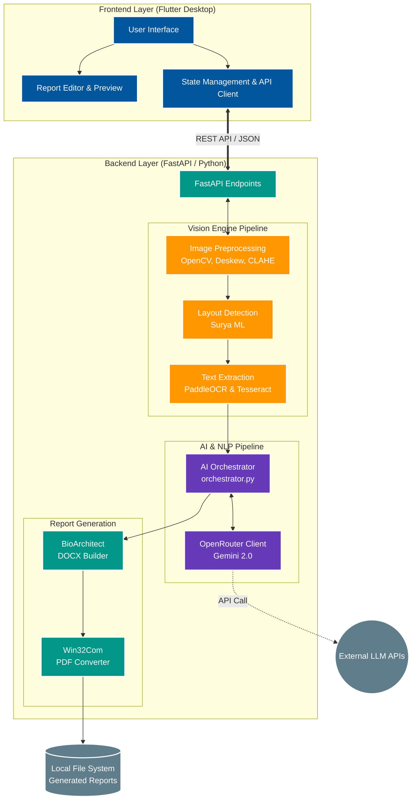
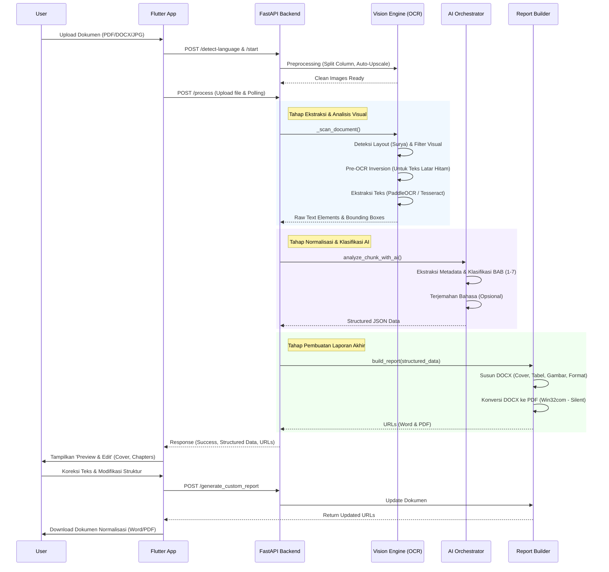

# Gambar 5.1: Diagram Arsitektur Sistem (Manbook-v4)

Diagram di bawah ini menggambarkan arsitektur *Client-Server* dari aplikasi Manbook-v4. Frontend dibangun dengan Flutter, sedangkan Backend menggunakan FastAPI dengan pipeline Computer Vision dan Generative AI.

---

# Gambar 5.2: Alur Kerja Sistem (System Workflow)

Alur kerja di bawah menunjukkan proses *end-to-end* sejak pengguna mengunggah dokumen hingga dokumen hasil normalisasi berhasil diunduh.

